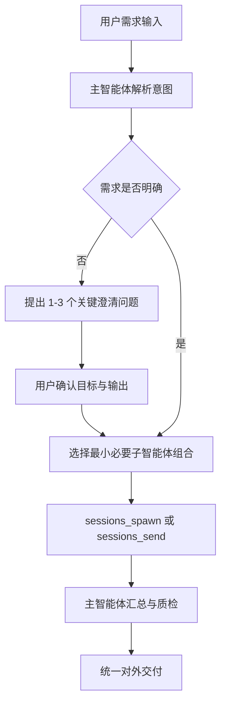

# 一、 产品智能体（Product Agent）核心架构设计

产品智能体系统不应是单一的、无状态的问答助手，而应是一个**多智能体协同（Multi-Agent System, MAS）**的产品工作流系统。

本项目基于 OpenClaw 平台构建，覆盖**需求输入 → 客研分析 → 产品探索 → 需求管理 → 方案设计 → 需求评审 → 用户分析**的产品全流程闭环。所有外部消息统一由主智能体（`main`）接收与回复，专业子智能体在后台按需协作，避免多角色对外口径不一致。

```
                       ┌────────────────────────┐
                       │   主智能体（main）       │ (统一入口与总调度中枢)
                       └───────────┬────────────┘
                                   │
         ┌─────────────────────────┼──────────────────────────────┐
         ▼                         ▼                              ▼
┌─────────────────┐       ┌─────────────────┐       ┌────────────────────┐
│ Customer        │       │ Product         │       │ Solution           │
│ Research Agent  │       │ Discovery Agent │       │ Design Agent       │
├─────────────────┤       ├─────────────────┤       ├────────────────────┤
│ • 客户访谈整理  │       │ • 竞品网页抓取  │       │ • PRD 自动生成     │
│ • 痛点提炼报告  │       │ • 差异面板输出  │       │ • 业务时序图绘制   │
└────────┬────────┘       └────────┬────────┘       └─────────┬──────────┘
         │                         │                           │
         └─────────────────────────┼───────────────────────────┘
                                   ▼
                       ┌────────────────────────┐
                       │  需求管理智能体         │ (飞书数据底座与状态运维)
                       └───────────┬────────────┘
                                   │
         ┌─────────────────────────┴─────────────────────────┐
         ▼                                                   ▼
┌─────────────────┐                                 ┌─────────────────┐
│ Requirement     │                                 │ User            │
│ Review Agent    │                                 │ Analysis Agent  │
├─────────────────┤                                 ├─────────────────┤
│ • 多角色评审    │ ───► (评审报告/整改追踪) ───►   │ • 舆情洞察      │
│ • 逻辑形式化验证│                                 │ • 指标异常诊断  │
└─────────────────┘                                 └─────────────────┘
```

### 核心底座机制

*   **主智能体统一入口**：所有外部消息统一经由 `main` 接收、澄清、调度和交付，子智能体不直接对外回复。
*   **按需最小调度原则**：先澄清目标，再选择最小必要子智能体组合。能由 1 个子智能体完成的任务，不派 2 个；仅复杂链路才串联多个子智能体。
*   **飞书需求数据底座**：需求管理智能体负责需求池、看板、归档与周报运维，将分散需求沉淀为可追踪记录。
*   **可追溯产物沉淀**：通过标准目录、状态字段和来源链接，将访谈报告、竞品证据、PRD、评审纪要、整改清单结构化留存。

---

# 二、 快速开始

> **使用方式**：将以下提示词直接发送给你的 OpenClaw，即可启动一键配置。

```
请帮我配置「产品管理智能体团队」。

**第一步：下载项目文件**
- 从 `https://github.com/AnatoleRise/product-agent-openclaw` 获取项目文件，完整下载到 `workspace/cache/product-agent-openclaw/` 目录下
- 若目录 `workspace/cache/product-agent-openclaw/` 已存在，则先删除再重新下载覆盖安装
- 若网络原因无法下载，则跳过下载直接进行第二步

**第二步：配置多 Agent 架构**
- 配置说明：`https://github.com/AnatoleRise/product-agent-openclaw/blob/main/agents-team-config.md`
- 参考上述配置说明，完成多 Agent 配置并将相关文件移动到位
- 目标架构为 1 个主智能体 `main` + 6 个子智能体：`customer_research`、`product_discovery`、`user_analysis`、`requirement_management`、`solution_design`、`requirement_review`
- 按步骤引导我完成

**第三步：安装全部技能**
skills 地址：`https://github.com/AnatoleRise/product-agent-openclaw/tree/main/skills`

多 Agent 配置完成后，将 `workspace/cache/product-agent-openclaw/skills/` 下带有 `SKILL.md` 的技能逐个移动到 `workspace/skills/`，并确保安装：

- 交互原型生成器（interactive-prototype-generator）：`/interactive-prototype-generator/`
- 飞书需求看板（feishu-requirement-board）：`/feishu-requirement-board/`
- 搜索引擎（search-engine）：`/search-engine/`
- 飞书需求录入（feishu-requirement-entry）：`/feishu-requirement-entry/`
- PRD文档生成器（prd-document-generator）：`/prd-document-generator/`
- 竞品调研（competitor-research）：`/competitor-research/`
- 问题追踪器（issue-tracker）：`/issue-tracker/`
- 报告生成器（report-generator）：`/report-generator/`
- 逻辑检测器（logic-detector）：`/logic-detector/`
- 飞书需求归档（feishu-requirement-archive）：`/feishu-requirement-archive/`
- 业务流程图生成器（business-diagram-generator）：`/business-diagram-generator/`
- 客研管理（customer-research）：`/customer-research/`
- 产品探索（product-exploration）：`/product-exploration/`
- 竞品网页抓取器（competitor-web-crawler）：`/competitor-web-crawler/`
- 竞品差异面板（difference-panel）：`/difference-panel/`
- 应用市场舆情洞察（app-market-sentiment）：`/app-market-sentiment/`
- 核心业务指标分析（core-metrics-analysis）：`/core-metrics-analysis/`
- 用户反馈结构化处理（user-feedback-processor）：`/user-feedback-processor/`
- 主动预警与风险拦截（alert-early-warning）：`/alert-early-warning/`
- 数据可视化与看板生成（data-visualization）：`/data-visualization/`
- 使用数据埋点与统计（telemetry-tracker）：`/telemetry-tracker/`（含配套 hook `telemetry-auto-track`，安装后需执行 `openclaw hooks enable telemetry-auto-track`，详见 agents-team-config.md）

请开始引导我配置吧！
```

> **注意**：产品探索智能体的真实子 Agent 目录是 `product_discovery/`，对应 OpenClaw Agent ID 为 `product_discovery`。不要把外部仓库中的 `agents/product-exploration-agent/` 当成本项目目录使用。`skills/pm-agent/` 当前为空占位目录，不应作为可安装 Skill 处理。

---

# 三、 核心智能体角色（Roles）与能力建设

产品智能体系统可划分为 **1 个主智能体 + 6 个专业子智能体**：

### 1. 主智能体（`main`）

*   **定位**：产品全流程总调度中枢，是系统唯一对外入口。
*   **功能**：识别用户目标、当前阶段、输入材料、期望输出与验收标准；按需路由并派发子智能体任务；维护需求状态与产物链路；汇总、校验并交付最终结果。
*   **输出**：统一回复、调度计划、子智能体结果汇总、最终交付说明。
*   **边界**：不跳过澄清直接执行复杂任务，不让子智能体直接面向用户交付最终结论。

### 2. 客研需求智能体（`customer_research`）

*   **输入**：客户访谈记录、会议纪要、录音转写、客户问题清单。
*   **功能**：整理访谈内容，提炼用户痛点，生成结构化访谈报告，并输出候选需求条目与待澄清问题。
*   **输出**：结构化访谈报告、痛点清单、候选需求条目、待澄清问题列表。
*   **边界**：不负责竞品对标结论，不负责 PRD 最终产出，不负责需求优先级最终裁定。

### 3. 产品探索智能体（`product_discovery`）

*   **输入**：用户分析指令、竞品名单、参考链接、分析维度模板。
*   **功能**：执行网页检索抓取、关键信息留存、内容清洗结构化、多维分析洞察，覆盖竞品分析与市场探索全流程。
*   **输出**：结构化竞品分析报告，包含来源链接、关键证据、差异结论与风险提示。
*   **边界**：不负责访谈原始信息采集，不负责需求池状态管理，不直接输出研发执行任务。

### 4. 产品方案智能体（`solution_design`）

*   **输入**：已归并需求、业务规则、交互约束、历史方案参考资料。
*   **功能**：围绕需求设计、原型设计、规范 PRD 输出形成方案产出能力，支持标准 PRD 自动生成、需求驱动原型草稿和业务时序图绘制。
*   **输出**：规范 PRD、Mermaid 业务时序图 / 流程图、可交互原型草稿。
*   **边界**：不直接判断需求来源真实性，不负责评审结论最终裁定，不负责需求池进度运维。

### 5. 需求评审智能体（`requirement_review`）

*   **输入**：PRD 文档、流程图、评审规则、历史缺陷与评审纪要。
*   **功能**：执行多阶段审查，包括多角色全方位审查、迭代校验、强制追溯元数据检查与结构化评审纪要生成。
*   **输出**：问题清单、风险分级、整改建议、追溯元数据完整性检查结果、评审纪要。
*   **边界**：不直接改写最终 PRD 定稿，不替代业务 Owner 决策，不负责需求池排期执行。
*   **配套 Skill**：
    *   **`PRD逻辑检测`**：形式化逻辑验证，覆盖状态机完整性、跨章节矛盾检测、数据流一致性、时序依赖验证，补充智能体在精确逻辑推理上的空白。
    *   **`跟踪评审问题整改`**：问题工单化、PRD 版本 Diff、修复效果逐项复检，形成"评审 → 跟踪 → 修复 → 复检"完整闭环。

### 6. 需求管理智能体（`requirement_management`）

*   **输入**：客研需求、用户反馈、竞品结论、评审结果、项目进度数据。
*   **功能**：依托飞书多维表格数据底座，覆盖需求捕捉、分析、交付、归档全流程自动化管理。
*   **输出**：需求漏斗结果、进度巡检预警、需求看板数据、归档统计结果。
*   **核心能力**：
    *   **需求漏斗**：归类、查重与价值初评。
    *   **定时巡检**：进度监控与风险自动预警。
    *   **智能问答 + 可视化看板**：支撑透明化决策。
    *   **全周期归档统计**：沉淀审计与复盘资产。

### 7. 用户分析智能体（`user_analysis`）

*   **输入**：应用市场评论、客服反馈、社群反馈、用户规模与容量流量等业务指标。
*   **功能**：提供应用市场舆情洞察与核心业务指标分析，支撑产品健康度、增长质量与版本风险诊断。
*   **输出**：舆情趋势、痛点需求清单、负面风险预警、指标异常诊断报告。
*   **边界**：不负责需求优先级最终裁定，不负责 PRD 文档定稿，不负责项目排期承诺。

---

# 四、 智能体系统的运行机制

要让产品智能体在真实产品工作中稳定运行，必须遵守以下四套核心机制：

### 1. 意图驱动的按需编排：调度流程

智能体在收到用户请求后，必须先澄清目标，再启动最小必要调度，严禁未澄清直接执行。



### 2. 典型路由映射

| 任务类型 | 调度路由 |
|:---|:---|
| 仅客户访谈整理 | `customer_research` |
| 仅竞品分析 | `product_discovery` |
| 仅 PRD 生成 | `solution_design` |
| 仅 PRD 评审 | `requirement_review` |
| 仅需求分级、去重、看板或归档 | `requirement_management` |
| 仅应用市场舆情或指标诊断 | `user_analysis` |
| 客访到 PRD 全链路 | `customer_research` → `requirement_management` → `solution_design` |
| 版本反馈预警与需求归并 | `user_analysis` → `requirement_management` |
| 竞品洞察转方案设计 | `product_discovery` → `requirement_management` → `solution_design` |
| 评审 + 整改跟踪 | `requirement_review` → `跟踪评审问题整改` |
| 逻辑检测 + 评审 | `PRD逻辑检测` → `requirement_review` |

### 3. 阶段流转校验

各阶段流转时，必须满足准入与准结校验，严禁"带病流转"。

| 阶段流转 | 智能体准入校验（DoR） | 智能体准结校验（DoD） | 失败处理 |
|:---|:---|:---|:---|
| **客研 → 需求管理** | 访谈记录就绪 | 痛点清单结构化 + 候选需求条目 ≥ 3 项 | 退回客研重新提炼 |
| **探索 → 方案设计** | 竞品名单与分析维度确认 | 竞品报告含来源链接 + 差异结论完整 | 退回探索补充证据 |
| **用户分析 → 需求管理** | 评论或指标数据来源明确 | 风险等级、影响范围、需求线索完整 | 退回用户分析补充证据 |
| **方案设计 → 评审** | 需求已归并完毕 | PRD 含验收场景 + 流程图完整 | 退回方案智能体补全 |
| **评审 → 需求管理** | 评审报告已生成 | Blocker 问题清零 + 整改追踪完成 | 阻断入库，退回整改 |

### 4. 共享产物与会话隔离机制

主智能体在调度子智能体时，必须提供完整上下文输入包，不能假设子智能体继承主智能体记忆。

*   **共享产物目录**：建议使用 `shared/intake`、`shared/customer_research`、`shared/product_discovery`、`shared/user_analysis`、`shared/requirements`、`shared/prd`、`shared/reviews`、`shared/release` 分阶段沉淀结果。
*   **状态字段约束**：每条需求至少维护 `requirement_id`、`source`、`status`、`owner_agent`、`input_paths`、`output_paths`、`risk_level`、`last_updated_at`。
*   **证据优先原则**：竞品结论、用户痛点、评审问题和风险预警都必须绑定来源链接、原始记录或判断依据，避免生成不可追溯的结论。

---

# 五、 产品智能体建设分阶段落地路线图

产品智能体的建设不建议一步到位，可以按照从"单点能力接入"到"全流程平台编排"的步骤逐步演进：

### 阶段 1：本地配置与单点能力接入（当前阶段）

*   **目标**：让产品经理能够通过 OpenClaw 平台规范化调用各项 AI 辅助能力。
*   **行动项**：
    1.  完成 6 个子智能体与 20 个已实现 Skill 的基础配置。
    2.  推广"先澄清目标、再调度执行"的使用规范。
    3.  建立飞书多维表格需求池数据底座。
    4.  对 `skills/pm-agent/` 空占位目录补齐 `SKILL.md`，或在安装流程中明确跳过。

### 阶段 2：全流程编排与闭环（规划中）

*   **目标**：实现"输入客户需求 → 智能体组队协同产出 → PRD 交付与评审归档"的低度干预闭环。
*   **行动项**：
    1.  搭建跨智能体状态同步机制，支持任务进度实时可见。
    2.  对接企业级知识库，实现历史 PRD、竞品报告与评审纪要的增量向量化（RAG）更新。
    3.  打通产品智能体与研发智能体，实现需求文档自动同步至研发侧。

### 阶段 3：研产协同与主动运维（预留方向）

*   **目标**：从被动响应式助手升级为可主动发现风险、推送进展、驱动整改的产品运维系统。
*   **行动项**：
    1.  将需求状态、项目周报、用户舆情和核心业务指标纳入统一巡检。
    2.  建立从用户反馈到需求入库、从评审问题到整改复检的自动追踪链路。
    3.  与研发智能体共享 PRD、验收场景、流程图和评审结论，降低研产交接损耗。

---

# 六、 配套智能体与 Skill 清单

### 6.1 子智能体清单

| 子智能体名称 | 路径 | 核心能力 |
|:---|:---|:---|
| `customer_research` | `customer_research/` | 用户需求深度访谈、痛点提炼与访谈报告生成，打通"收集 → 梳理 → 分析"链路 |
| `product_discovery` | `product_discovery/` | 竞品与市场探索专家，自动抓取竞品网页、整理结构化证据、输出分析报告与差异面板 |
| `solution_design` | `solution_design/` | 快速生成专业 PRD、业务流程图和可交互 UI 原型，提供完整前期方案 |
| `requirement_review` | `requirement-review/` | PRD 审查专家，支持多角色全方位审查、迭代校验、追溯元数据完整性检查与结构化评审纪要 |
| `requirement_management` | `requirement_management/` | 飞书需求管理系统日常运维，负责刷新看板、归档需求、生成周报 |
| `user_analysis` | `user_analysis/` | 自动化获取用户数据与评论，分析问题并主动预警，为需求提供数据支撑 |

### 6.2 Skill 清单

| Skill 名称 | 路径 | 说明 |
|:---|:---|:---|
| `搜索引擎` | `skills/search-engine/` | 多源搜索策略与意图解析，支持网页检索抓取、内容清洗与可溯源信息留存 |
| `竞品调研` | `skills/competitor-research/` | 竞品信息采集、多维分析洞察与结构化竞品分析报告生成 |
| `PRD文档生成器` | `skills/prd-document-generator/` | 基于模板与需求输入，自动生成标准化 PRD 文档 |
| `业务流程图生成器` | `skills/business-diagram-generator/` | 业务时序图、流程图自动绘制，支持 PlantUML 画板输出 |
| `交互原型生成器` | `skills/interactive-prototype-generator/` | 需求驱动的可交互原型快速产出，支撑方案可视化 |
| `PRD逻辑检测` | `skills/logic-detector/` | 形式化逻辑验证：状态机完整性、跨章节矛盾检测、数据流一致性、时序依赖验证 |
| `问题追踪器` | `skills/issue-tracker/` | 问题工单化、PRD 版本 Diff、修复效果复检、整改统计与趋势分析 |
| `报告生成器` | `skills/report-generator/` | 结构化报告模板渲染、数据清洗与多格式报告输出 |
| `客研管理` | `skills/customer-research/` | 从访谈记录中提炼痛点，生成结构化访谈报告、候选需求条目与待澄清问题列表 |
| `飞书需求录入` | `skills/feishu-requirement-entry/` | 需求信息标准化录入飞书多维表格，智能评估并生成分析报告 |
| `飞书需求看板` | `skills/feishu-requirement-board/` | 飞书多维表格需求数据可视化看板，支持筛选、图表与周报自动输出 |
| `飞书需求归档` | `skills/feishu-requirement-archive/` | 需求全周期归档统计，周度扫描已上线 / 已转出需求并生成归档报告 |
| `产品探索` | `skills/product-exploration/` | 竞品分析主技能，编排竞品网页抓取、结构化报告与差异面板输出 |
| `竞品网页抓取器` | `skills/competitor-web-crawler/` | 根据产品探索意图自动发现并抓取竞品网页，返回去重后的结构化网页证据 |
| `竞品差异面板` | `skills/difference-panel/` | 将竞品数据转化为维度化差异面板，标注领先 / 持平 / 缺失 / 未知及来源引用 |
| `应用市场舆情洞察` | `skills/app-market-sentiment/` | 分析应用商店用户评论，识别版本发布后舆情风险，提炼用户痛点需求 |
| `核心业务指标分析` | `skills/core-metrics-analysis/` | 通过规模指标与价值指标交叉分析，诊断产品健康度与增长质量 |
| `用户反馈结构化处理` | `skills/user-feedback-processor/` | 整合客服、应用商店、社群、问卷等多渠道反馈，进行清洗、去重、归类和需求提取 |
| `主动预警与风险拦截` | `skills/alert-early-warning/` | 实时捕捉舆情爆发点与指标异常值，支持多级别预警、多渠道通知和智能阈值调整 |
| `数据可视化与看板生成` | `skills/data-visualization/` | 将分析结果转化为可交互 HTML 看板，支持趋势图、饼图、热力图、词云等图表类型 |
| `使用数据埋点与统计` | `skills/telemetry-tracker/` | 使用数据双轨采集（hook 对话级 + 智能体能力级）与统计，写入 SQLite，支持使用情况查询与中文文本汇报；含配套 `telemetry-auto-track` 钩子 |
