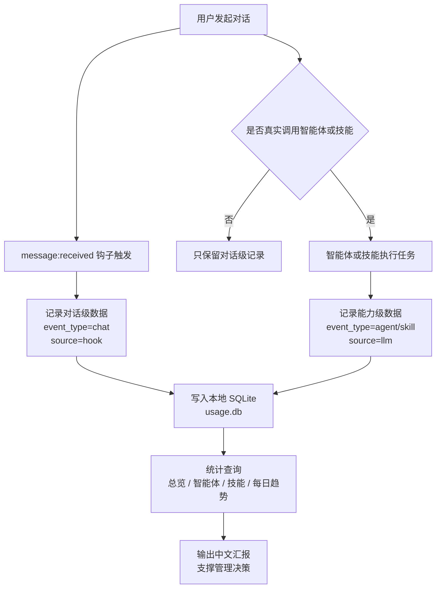

# 数据埋点能力汇报

## 一、要解决什么业务问题

当前 OpenClaw 已经接入多个智能体和技能，但如果没有使用数据，就很难判断系统是否真的被使用、哪些能力有价值、哪些能力需要优化。

数据埋点主要解决以下业务问题：

- **看整体活跃度**：判断用户是否持续使用 OpenClaw，以及近期使用频次是否稳定。
- **看能力使用情况**：识别哪些智能体、哪些技能被真实调用，而不是只停留在“已经建设完成”。
- **看投入优先级**：根据高频使用能力，判断后续应该重点增强哪些方向。
- **看低效能力**：发现长期低使用能力，为入口优化、能力合并或下线提供依据。
- **支撑管理汇报**：把智能体建设情况从“功能描述”变成“使用数据 + 趋势判断”。

简单来说，这套埋点能力是为了回答三个问题：**有没有人用、大家在用什么、后续应该重点投入哪里**。

## 二、现在能拿到什么数据、能做到什么（数据怎么来的）

目前系统采用“双轨采集”方式，分别记录对话发生情况和能力调用情况。



### 1. 对话级数据

用户每发起一轮对话，系统会通过 `telemetry-auto-track` 钩子自动记录一条 `chat` 事件。

这类数据可以用于统计：

- 总对话量
- 每日使用趋势
- 最近 7 天、30 天活跃情况
- 用户是否持续使用系统

对话级数据由系统 hook 自动采集，覆盖率接近 100%，适合作为整体活跃度口径。

### 2. 能力级数据

当某个智能体或技能被真实调用，并且产生了实际结果时，系统会记录一条 `agent` 或 `skill` 事件。

这类数据可以用于统计：

- 哪些智能体被调用最多
- 哪些技能使用频率最高
- 某个能力最近是否被真实使用
- 不同能力之间的使用量对比
- 哪些能力使用较少，需要优化或治理

能力级数据依赖智能体执行后补充上报，适合用于判断能力使用趋势。汇报时应把它理解为“能力调用下限”，不要和对话量简单相加。

### 3. 数据存储

埋点数据统一写入本地 SQLite 数据库：

```text
~/.openclaw/workspace/shared/telemetry/usage.db
```

如果数据库写入失败，系统会写入兜底日志，避免数据丢失：

```text
~/.openclaw/workspace/shared/telemetry/failed_events.jsonl
```

当前数据存储在本地，不依赖外部统计平台。

## 三、怎么查询数据

现在可以直接用自然语言询问系统，由系统根据问题选择对应统计口径并输出中文汇报。

常见查询方式包括：

- 最近 7 天使用情况怎么样？
- 最近 30 天整体调用量是多少？
- 每天的使用趋势是什么？
- 哪个智能体用得最多？
- 哪个 Skill 调用最多？
- 产品探索智能体最近调用了多少次？
- 需求评审和竞品调研哪个使用更多？
- 最近大家主要在问什么类型的问题？
- 导出一份最近 30 天使用统计。

系统支持的主要统计维度包括：

- **按时间查询**：近 7 天、近 30 天、自定义日期范围。
- **按智能体查询**：查看不同智能体的调用情况。
- **按技能查询**：查看不同技能的使用情况。
- **按每日趋势查询**：查看使用量是否增长、下降或波动。
- **按用户查询**：在能识别用户身份的情况下，查看不同用户的使用情况。

对领导汇报时，建议优先展示三类数据：整体活跃趋势、高频智能体、高频技能。

## 四、隐私与合规

当前埋点能力遵循本地存储和最小化记录原则。

- **本地存储**：数据写入本地 SQLite 数据库，不自动上传到第三方平台。
- **有限记录**：用户原始问题只保留截断后的文本，最多 500 字。
- **身份尽力识别**：系统会尽量通过会话标识识别用户；识别不到时按匿名用户记录，不影响统计。
- **失败兜底**：写库失败时写入本地兜底日志，不影响用户正常使用。
- **运行时数据不入库 Git**：`usage.db`、`failed_events.jsonl`、用户身份映射等运行时文件不应提交到代码仓库。

需要注意的是，用户问题文本可能包含业务信息或敏感内容，因此后续如果要做更正式的数据分析或对外汇报，应增加脱敏、权限控制和数据保留周期策略。

## 五、后续规划

后续可以从“统计可用”升级到“管理可用”和“运营可用”。

### 1. 数据口径完善

- 固化对话量、能力调用量、活跃用户数、高频能力等核心指标。
- 明确对话级数据和能力级数据的区别，避免重复计算。
- 对历史匿名用户和真实用户做身份合并，减少统计碎片。

### 2. 查询体验优化

- 支持更稳定的自然语言查询，例如“本周哪个智能体增长最快”。
- 增加固定汇报模板，自动生成周报或月报。
- 支持导出 Markdown、JSONL 或表格，方便汇报复用。

### 3. 可视化能力建设

- 建设轻量看板，展示整体趋势、高频智能体、高频技能和异常波动。
- 支持按时间范围、用户、智能体、技能筛选。
- 对低使用能力、高增长能力做自动标记。

### 4. 合规与治理增强

- 增加敏感词脱敏机制，降低用户原文带来的隐私风险。
- 增加数据保留周期，例如只保留最近 90 天明细，长期只保留聚合数据。
- 明确谁可以查看明细数据、谁只能查看汇总数据。

### 5. 管理决策联动

- 将使用数据和智能体建设计划关联。
- 对长期低使用能力建立治理机制。
- 对高频能力建立专项优化计划，让数据直接服务后续产品迭代。
